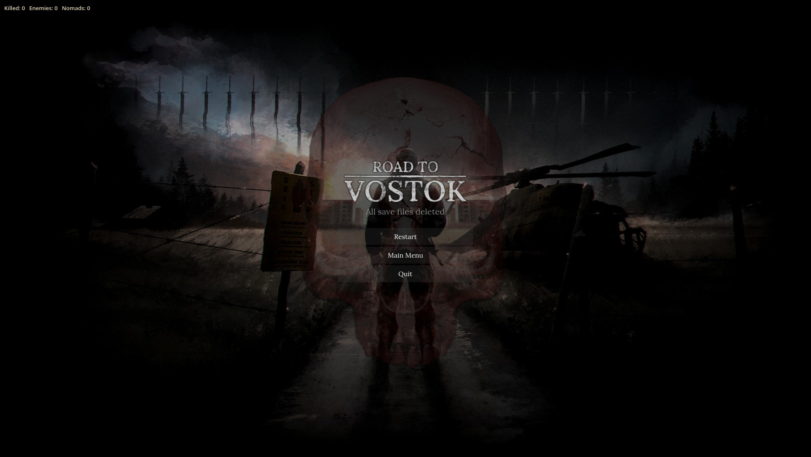

# Vostok Toolkit

Мод для **Road to Vostok**: панель с наборами снаряжения, телепортом и настройками — одним хоткеем.

**Версия:** 4.7.2 · **Загрузчик:** Metro Mod Loader 3.4.2 · **Язык:** RU / EN

## Возможности

| Раздел | Что делает |
|---|---|
| **Наборы** | Раскладки снаряжения: пикер предметов с поиском и фильтрами по категориям, несколько сохраняемых сетов, быстрое применение клавишами **7 / 8 / 9** |
| **Телепорт** | Переход между картами, убежищами и трейдерами |
| **Настройки** | Язык интерфейса (RU/EN), клавиша панели, тумблеры UI |
| **Счётчик убийств** | Счётчик на HUD |
| **Тепловизор (NVG)** | Свой шейдер ночника: тепловизионная палитра и подсветка ботов и мин |
| **Ironman-safe рестарт** | После смерти в железном забеге рестарт сохраняет permadeath, а не выключает его |

## Установка

1. Установи Metro Mod Loader для Road to Vostok.
2. Скачай `Loadouts.vmz` из [Releases](https://github.com/dgtball/VostokToolKit/releases).
3. Положи файл в `Road to Vostok\mods\`.
4. Запусти игру.

## Использование

- Панель вызывается клавишей `key_ui_toggle` — она настраивается в MCM мода.
- **7 / 8 / 9** — применить быстрый набор.
- Наборы хранятся в `user://MCM/vostok-toolkit/VTKsets.json`, настройки интерфейса — в `ui_toggles.json` рядом.

## Сборка из исходников

`.vmz` — это zip содержимого папки `loadouts/`: на верхнем уровне архива должны лежать `mod.txt` и `mods/` (без корневой папки `loadouts`). Запакуй папку любым zip-архиватором и переименуй в `.vmz`, либо используй `pack.ps1` из полной рабочей копии проекта.

## Структура репозитория

- `loadouts/mod.txt` — имя, id, версия, автолоад
- `loadouts/mods/VTK/*.gd` — исходники мода (префикс `VTK`)
- `assets/` — изображения для README

## Совместимость

Проверялся в связке с MultiSaveSlots Reborn, ElegantHUD и другими распространенными модами; конфликты маловероятны, но бэкап забега перед первым запуском — хорошая привычка.

## Лицензия

[MIT](LICENSE). Независимый мод сообщества, не связан с Road to Vostok и его автором.
